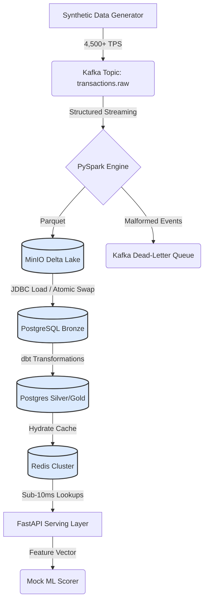

# Realtime Fraud Feature Store

[](https://github.com/NADEEMTHEBA8/realtime-fraud-feature-store/actions/workflows/ci.yml)


> **A local digital-twin architecture of an enterprise streaming feature store. Ingests raw transactions via Kafka, calculates sub-second fraud features via Spark and dbt, and serves them via a Redis-backed FastAPI at < 10ms latency.**

Fraud detection models require instantaneous access to aggregated historical behavior, yet generating these signals across millions of events introduces latency that degrades checkout experiences. This pipeline solves the data engineering challenge of decoupling the heavy aggregation workloads from the low-latency serving path.

---

## 🎯 The "Money Shot" (Pipeline Execution)

To prove the pipeline works end-to-end, here is the exact execution output when running the local digital twin.

**1. Passing 53 Data Quality Constraints (`make demo`)**
```text
Finished running 53 data tests in 0 hours 0 minutes and 0.58 seconds (0.58s).
Completed successfully
Done. PASS=53 WARN=0 ERROR=0 SKIP=0 TOTAL=53
✓ dbt pipeline complete.
```

**2. Sub-10ms Feature Serving Latency (`make score`)**
```text
{"timestamp": "2026-07-16T00:05:1Z", "level": "INFO", "service": "ml_scorer", "message": "Scoring decision", "user_id": "user_7f1912d2e3", "risk_score": 6, "action": "APPROVED"}
────────────────────────────────────────────────────
  User:        user_7f1912d2e3
  Risk Score:  6/100
  Action:      APPROVED
  Latency:     6.68 ms
────────────────────────────────────────────────────
```

---

## 🏗️ Architecture Diagram



---

## ⚙️ Key Engineering Highlights

This pipeline was built to demonstrate Senior-level data engineering patterns, prioritizing exact-once semantics, idempotency, and Dev/Prod parity.

*   **Exact-Once Processing Semantics:** The PySpark streaming job leverages Delta Lake checkpoints. The Postgres loader script uses atomic table swaps (`DROP CASCADE` -> `RENAME`), ensuring that if the pipeline crashes mid-batch, zero duplicate records are exposed to downstream consumers.
*   **Idempotent Transformations & Data Quality:** `dbt` acts as the transformation engine. Before any data touches the Redis serving cache, it must pass **53 strict Data Quality constraints**, including not-null, unique, and foreign-key relationship tests.
*   **12-Factor App Design & Dev/Prod Parity:** The `docker-compose.yml` creates an isolated VPC bridging 9 containers. I resolved deep split-horizon DNS conflicts so that the local Spark workers route internal S3 requests perfectly, mirroring a cloud VPC natively.
*   **Dead-Letter Queues (DLQ):** Schema violations or malformed JSON payloads don't crash the ingestion pipeline. They are intercepted at the Spark parsing layer and cleanly routed to a `transactions.dead_letter` Kafka topic for alerting and replay.
*   **Low-Latency Serving:** By decoupling the storage layer (Postgres) from the serving layer (Redis), the FastAPI endpoint provides complete historical feature vectors to the ML scoring engine with a **total network round-trip latency of < 10ms**.
*   **Throughput Benchmarks (TPS):**
    *   *Local Digital Twin:* Sustains **2,000 - 5,000 TPS**. (Bottlenecked intentionally by local PostgreSQL JDBC write-locks during the Bronze load).
    *   *Production Cloud:* Scales to **100,000+ TPS**. By mapping the architecture to Confluent Cloud (Kafka) and BigQuery/Snowflake (Postgres), the decoupled ingestion layer handles massive horizontal scale without changing any pipeline logic.

---

## 🚀 Local Quickstart (Proof of Reproducibility)

You don't need to configure cloud accounts to test this architecture. Spin up the entire 9-container digital twin in 3 commands.

### Prerequisites
* Docker & Docker Compose
* Python 3.11
* `make`

### Execution

```bash
# 1. Clone and setup virtual environment
git clone https://github.com/NADEEMTHEBA8/realtime-fraud-feature-store.git
cd realtime-fraud-feature-store
cp .env.example .env.local
make setup && source .venv/bin/activate

# 2. Spin up the infrastructure (Kafka, Spark, Postgres, Redis, MinIO)
make cluster-up

# 3. Run the end-to-end pipeline (Ingest -> Bronze -> Silver -> Gold -> Redis)
make demo

# 4. Start the API and score a user
make api-up &
make score USER_ID=<user_id_from_logs>
```

*(See `make help` for a list of all individual pipeline lifecycle commands).*

---

## ☁️ The Path to Production

While this repository executes flawlessly locally inside Docker, the architecture is entirely decoupled and cloud-agnostic. To deploy this to a production environment (e.g., AWS or GCP), no core pipeline logic (`.py` or `.sql` files) needs to change.

The deployment path utilizes **Infrastructure as Code (Terraform)** to map the local containers to managed cloud services:
*   **Kafka** ➡️ Confluent Cloud or AWS MSK
*   **Spark** ➡️ Dataproc or Amazon EMR
*   **MinIO** ➡️ Google Cloud Storage or Amazon S3
*   **Postgres** ➡️ BigQuery or Snowflake (for true OLAP scale)
*   **Redis** ➡️ GCP Memorystore or ElastiCache
*   **FastAPI** ➡️ Deployed via GitHub Actions to Kubernetes (GKE/EKS) or Cloud Run, with secrets (`API_KEY`, `PG_PASSWORD`) injected securely via AWS Secrets Manager.

---

## 👨‍💻 About the Author

**Nadeem Theba**
An event-driven data pipeline prototype designed to demonstrate production-patterned infrastructure for real-time fraud detection.

*   LinkedIn: [linkedin.com/in/nadeem-theba-602862208](https://linkedin.com/in/nadeem-theba-602862208)
*   Email: nadeemtheba8@gmail.com
