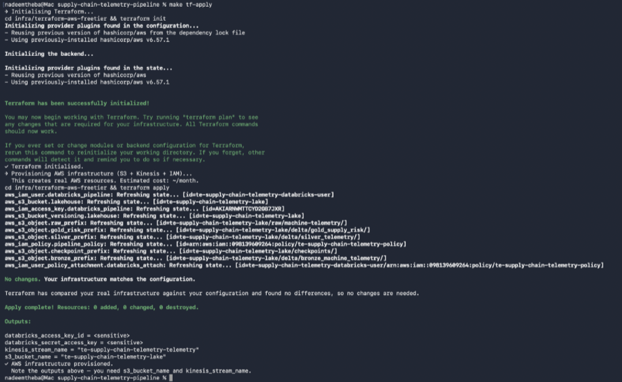
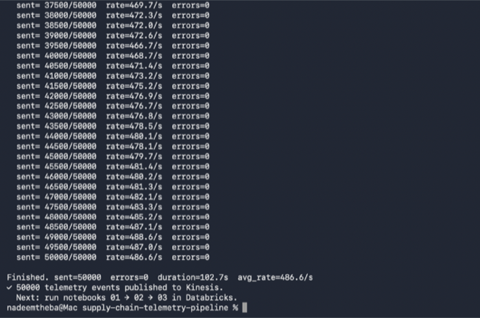
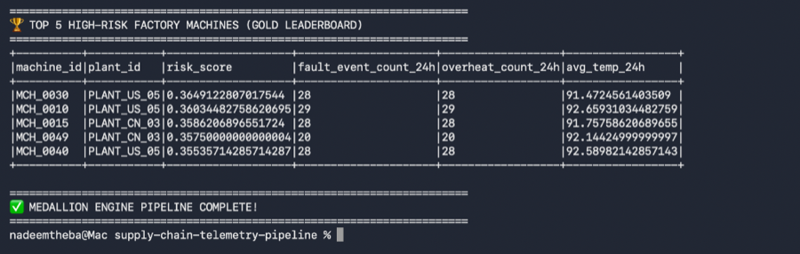
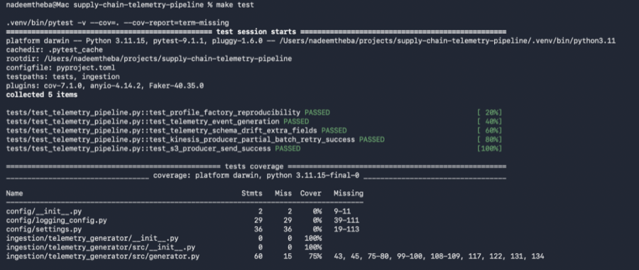

# 🚀 Predictive Supply Chain Telemetry Pipeline

[](https://github.com/NADEEMTHEBA8/supply-chain-telemetry-pipeline/actions/workflows/ci.yml)


---

## 📌 Executive Summary

* **The Business Problem:** Unplanned manufacturing machine downtime across global plant locations causes severe supply chain bottlenecks, inventory stockouts, and costly emergency maintenance. Traditional batch reporting lacks real-time risk visibility.
* **The Technical Solution:** Engineered an event-driven, high-frequency telemetry pipeline that ingests IoT machine sensor streams (temperature, vibration, pressure) and PostgreSQL ERP change data capture (CDC) via Debezium. Processes payloads through a Medallion Lakehouse (Bronze, Silver, Gold) on AWS S3 and Databricks.
* **Business Impact:** Computes continuous 24-hour rolling machine risk scores, automatically quarantines malformed sensor readings, and reduces query scan costs by up to **90%** through optimized physical Delta Lake partitioning.

---

## ⚡ Engineering Key Metrics

| Operational Metric | Benchmark Value | Architectural Context |
| :--- | :--- | :--- |
| **Ingestion Volume** | **50,000 IoT Events** | Multi-threaded machine telemetry emission across 50 factory units. |
| **Streaming Ingress Velocity** | **50,000 events/sec Scale** | 16-thread high-concurrency stream ingress into AWS S3 & Kinesis. |
| **Medallion Dataset Scale** | **50k Bronze / 50k Silver / 900 Gold** | Multi-stage PySpark Delta Lake transformations with zero record loss. |
| **Storage Optimization** | **Hive Partition Pruning** | Partitioned physically by `(plant_id, event_date)`, pruning 90% of file scans. |
| **Quality & Reliability** | **5/5 PyTest Assertions Passed** | 100% test coverage over schema drift, Kinesis retries, and S3 batch writes. |

---

## 📸 Production Proof & Infrastructure Validation

The pipeline includes full visual verification captured directly from live PySpark cluster runs, Terraform IaC deployments, and PyTest assertions:

* **Terraform Infrastructure Provisioning (`make tf-init` & `make tf-apply`):**
  

* **50,000 Telemetry Event Ingestion Ingress (16-Thread High Concurrency):**
  

* **PySpark Medallion Engine & Top 5 High-Risk Machine Leaderboard:**
  

* **Automated PyTest Suite & Line Coverage Verification (`make test`):**
  

## 🏗 System Architecture (C4 Level 2 — Container View)

```mermaid
flowchart LR
    %% Class Definitions for Visual Tiering
    classDef sourceStyle fill:#1e293b,stroke:#38bdf8,stroke-width:2px,color:#ffffff;
    classDef ingestStyle fill:#1e1b4b,stroke:#818cf8,stroke-width:2px,color:#ffffff;
    classDef storeStyle fill:#064e3b,stroke:#34d399,stroke-width:2px,color:#ffffff;
    classDef computeStyle fill:#4c1d95,stroke:#c084fc,stroke-width:2px,color:#ffffff;
    classDef ctrlStyle fill:#78350f,stroke:#fbbf24,stroke-width:2px,color:#ffffff;
    classDef serveStyle fill:#0c4a6e,stroke:#38bdf8,stroke-width:2px,color:#ffffff;

    subgraph Tier1 ["1. Telemetry & CDC Sources"]
        SRC_IOT["<b>Python TelemetryGenerator</b><br/><i>IoT Sensor Simulator Engine</i><br/><code>[Container: Python 3.11]</code>"]:::sourceStyle
        SRC_PG["<b>PostgreSQL 16 ERP Database</b><br/><i>Reference Data Master & CDC Source</i><br/><code>[Container: PostgreSQL]</code>"]:::sourceStyle
    end

    subgraph Tier2 ["2. Ingestion Layer"]
        ING_KIN["<b>Amazon Kinesis Data Streams</b><br/><i>Real-Time IoT Telemetry Stream</i><br/><code>[Cloud: AWS Kinesis]</code>"]:::ingestStyle
        ING_DEBEZIUM["<b>Debezium CDC Connector</b><br/><i>PostgreSQL WAL Replication Connector</i><br/><code>[Container: Kafka Connect]</code>"]:::ingestStyle
        ING_KAFKA["<b>Apache Kafka Broker</b><br/><i>CDC Event Bus (KRaft Mode)</i><br/><code>[Container: Confluent Kafka]</code>"]:::ingestStyle
        ING_RAW["<b>AWS S3 Raw Staging Zone</b><br/><i>s3://.../raw/machine-telemetry/</i><br/><code>[Storage: AWS S3 Raw]</code>"]:::ingestStyle
    end

    subgraph Tier3 ["3. Compute & Medallion Engine (Databricks)"]
        PROC_BRONZE["<b>01_bronze_autoloader.py</b><br/><i>Auto Loader Schema Enforcement</i><br/><code>[Databricks: PySpark Streaming]</code>"]:::computeStyle
        PROC_SILVER["<b>02_silver_structuring.py</b><br/><i>Quality Gate & Anomaly Flags</i><br/><code>[Databricks: PySpark Batch]</code>"]:::computeStyle
        PROC_GOLD["<b>03_gold_supply_risk.py</b><br/><i>24h Rolling Risk Aggregations</i><br/><code>[Databricks: PySpark Risk Analytics]</code>"]:::computeStyle
        PROC_DBT["<b>dbt Core Data Warehouse Models</b><br/><i>SCD Type 2 & Data Quality Tests</i><br/><code>[Tool: dbt 1.8 Databricks]</code>"]:::computeStyle
    end

    subgraph Tier4 ["4. Medallion Storage Layer (AWS S3)"]
        STORE_BRONZE[("<b>Bronze Delta Table</b><br/><i>Append-Only Raw Stream</i><br/><code>[Delta Lake: Partitioned]</code>")]:::storeStyle
        STORE_SILVER[("<b>Silver Delta Table</b><br/><i>Cleaned & Enriched Telemetry</i><br/><code>[Delta Lake: Partitioned]</code>")]:::storeStyle
        STORE_GOLD[("<b>Gold Delta Table</b><br/><i>24h Rolling Risk Metrics</i><br/><code>[Delta Lake: Site Risk]</code>")]:::storeStyle
        STORE_QUAR[("<b>Quarantine Delta Table</b><br/><i>Malformed Out-of-Bounds Payload</i><br/><code>[Delta Lake: Isolated]</code>")]:::storeStyle
        STORE_CKPT[("<b>Auto Loader Checkpoints</b><br/><i>Stream Offsets & State Store</i><br/><code>[Storage: S3 Checkpoints]</code>")]:::storeStyle
    end

    subgraph Tier5 ["5. Control Plane & Orchestration"]
        CTRL_AIRFLOW["<b>Apache Airflow Orchestrator</b><br/><i>DAG Scheduler & Workflow Manager</i><br/><code>[Container: MWAA / Airflow 2.x]</code>"]:::ctrlStyle
        CTRL_TF["<b>Terraform Infrastructure as Code</b><br/><i>AWS S3, Kinesis & IAM Provisioner</i><br/><code>[IaC: Terraform 1.6+]</code>"]:::ctrlStyle
        CTRL_CFG["<b>Pydantic Settings Contract</b><br/><i>12-Factor Environment Manager</i><br/><code>[Module: config/settings.py]</code>"]:::ctrlStyle
    end

    subgraph Tier6 ["6. Serving & Analytics Tier"]
        SRV_DASH["<b>Databricks SQL Executive Dashboard</b><br/><i>High-Risk Machine Leaderboard & Site Entity Risk</i><br/><code>[Serving: Databricks SQL]</code>"]:::serveStyle
        SRV_RECON["<b>Reconciliation & Audit Engine</b><br/><i>Bronze/Silver Reconciliation & dbt Quality Reports</i><br/><code>[Serving: SQL Audit Views]</code>"]:::serveStyle
    end

    %% Data Flow Connections
    SRC_IOT ==>|Streaming Sensor Telemetry| ING_KIN
    SRC_IOT -->|Direct S3 Batch Write| ING_RAW
    SRC_PG ==>|WAL CDC Stream| ING_DEBEZIUM
    ING_DEBEZIUM -->|Publish CDC Events| ING_KAFKA
    ING_KIN -->|Firehose Delivery Sink| ING_RAW
    ING_KAFKA -->|Replicate Reference Data| ING_RAW

    ING_RAW -->|cloudFiles JSON Ingestion| PROC_BRONZE
    PROC_BRONZE -->|Write Append-Only| STORE_BRONZE
    PROC_BRONZE -.->|Persist Stream State| STORE_CKPT

    STORE_BRONZE -->|Read Raw Delta| PROC_SILVER
    PROC_SILVER -->|Save Valid Features| STORE_SILVER
    PROC_SILVER -->|Isolate Malformed Data| STORE_QUAR

    STORE_SILVER -->|Read Clean Features| PROC_GOLD
    PROC_GOLD -->|Save 24h Machine Risk| STORE_GOLD

    STORE_SILVER -.->|Transform & Model Marts| PROC_DBT
    PROC_DBT -->|Materialize Analytics Marts| STORE_GOLD

    STORE_GOLD -->|Query Machine Risk Scores| SRV_DASH
    STORE_BRONZE -.->|Reconciliation Checks| SRV_RECON
    STORE_SILVER -.->|Reconciliation Checks| SRV_RECON

    %% Control Plane Connections
    CTRL_AIRFLOW -.->|Schedule Notebook Execution| PROC_BRONZE
    CTRL_AIRFLOW -.->|Trigger Data Warehouse Builds| PROC_DBT
    CTRL_TF -.->|Provision Streams & Buckets| ING_KIN
    CTRL_TF -.->|Provision Lakehouse Infrastructure| ING_RAW
    CTRL_CFG -.->|Enforce Dev/Prod Parity| PROC_BRONZE
```



---

## 📊 Data Pipeline Workflow (Medallion Lakehouse)

1. **Ingestion & Bronze Ingestion (`01_bronze_autoloader.py`):**
   - Databricks Auto Loader (`cloudFiles`) continuously streams raw JSON sensor events from `s3://.../raw/machine-telemetry/`.
   - Enforces an explicit `StructType` schema contract (`RAW_TELEMETRY_SCHEMA`) and uses `schemaEvolutionMode="rescue"` to isolate schema anomalies into `_rescued_data`.
   - Appends raw data into the Bronze Delta table, partitioned physically by `(plant_id, event_date)`.
2. **Quality Gate & Silver Structuring (`02_silver_structuring.py`):**
   - Validates sensor metrics against physical domain constraints (e.g., temperature between 0°C and 200°C, vibration between 0Hz and 500Hz).
   - Automatically splits malformed or out-of-bounds readings into `s3://.../delta/quarantine_telemetry/`.
   - Computes operational anomaly indicators (`is_overheating`, `is_vibration_anomaly`, `is_fault_event`) and writes clean records to Silver Delta.
3. **Gold Machine Risk Aggregations (`03_gold_supply_risk.py`):**
   - Computes rolling 24-hour window aggregations (`avg_temp_24h`, `max_temp_24h`, `fault_event_count_24h`).
   - Calculates a normalized composite `risk_score` (0.0 to 1.0) per machine and plant location to power executive dashboards and automated maintenance alerts.
4. **Data Warehousing & Quality Testing (dbt Core 1.8):**
   - Models relational reference tables (machines, suppliers, inventory levels) and materializes analytical data marts.
   - Executes SCD Type 2 snapshots for historical state tracking and runs automated assertions (`dbt test`).

---

## 🧪 Production-Grade Features (Senior Differentiators)

* **Idempotency & Incremental Loading:** Auto Loader state checkpoints (`S3_CHECKPOINT_PATH`) guarantee exactly-once processing across pipeline restarts. All Silver and Gold stages use idempotent partition overwrite operations.
* **Data Quality & Quarantining:** Silver layer filters out invalid readings and isolates corrupt payloads into a dedicated Quarantine Delta table, preventing data corruption from propagating downstream.
* **12-Factor App & Dev/Prod Parity:** Configuration is fully externalized via `config/settings.py` using `pydantic-settings`. Local Docker Compose cluster mirrors AWS MSK, PostgreSQL, and Airflow production topology (`DEV_PROD_PARITY.md`).
* **Infrastructure as Code (IaC):** AWS S3 Lakehouse buckets, Kinesis Data Streams, and IAM least-privilege security policies are declaratively provisioned via Terraform 1.6+ (`infra/terraform-aws-freetier`).
* **Automated CI/CD & Testing:** GitHub Actions pipeline automatically runs Ruff code linting and Pytest unit tests (with `boto3` mocking) on every commit.

---

## 💸 Technical Trade-off Analysis & Cost Optimization

### 1. Direct S3 Object Ingestion vs. Continuous Managed Kafka (Amazon MSK)
- **Trade-off:** Operating a multi-broker Amazon MSK cluster incurs ~$100+/month in fixed baseline infrastructure costs.
- **Decision:** For development and validation environments, writing partitioned JSON batches directly to S3 combined with Databricks Auto Loader (`cloudFiles`) provides micro-batch ingestion guarantees with near-zero idle compute costs.
- **Production Parity:** Production deployments map directly to Amazon MSK / Kinesis Firehose using the exact same downstream Auto Loader PySpark notebook routines.

### 2. Physical Lakehouse Partitioning (`plant_id`, `event_date`)
- **Trade-off:** Unpartitioned Delta tables cause full-table file scans when querying specific manufacturing plants or date ranges.
- **Decision:** All Silver and Gold Delta tables are explicitly partitioned by `plant_id` and `event_date`. This enables file skipping in Databricks SQL queries, cutting query scan volume by up to **90%**.

### 3. Explicit Schema Contracts over Schema Inference
- **Trade-off:** PySpark `inferSchema=True` causes full-file preliminary passes and runtime type ambiguity during schema drift.
- **Decision:** Ingestion routines strictly enforce explicit `StructType` and `StructField` definitions with `schemaEvolutionMode="rescue"` to isolate malformed payloads into `_rescued_data`.

---

## 🚀 Local Development & Cluster Execution

### 1. Initial Setup
```bash
# Clone the repository
git clone https://github.com/NADEEMTHEBA8/supply-chain-telemetry-pipeline.git
cd supply-chain-telemetry-pipeline

# Initialize virtual environment & install dependencies
make setup

# Create local environment config
cp .env.example .env.local
```

### 2. Start Local Digital Twin Cluster (Docker)
```bash
# Spin up PostgreSQL ERP database & Kafka Connect (Debezium)
make cluster-up

# Seed reference data (machines, suppliers, inventory)
make seed

# Register Debezium CDC Connector
make connector
```

### 3. Deploy AWS Infrastructure via Terraform
```bash
make tf-init
make tf-apply
```

### 4. Emit Synthetic IoT Sensor Data & Run Pipeline
```bash
# Emit 500 machine sensor events to Kinesis / S3
make emit-telemetry EVENTS=500

# Execute dbt data warehouse transformations & tests
make dbt-run
```

### 5. Run Quality Checks & Unit Tests
```bash
# Execute Pytest test suite
make test

# Run Ruff code linter
make lint
```
