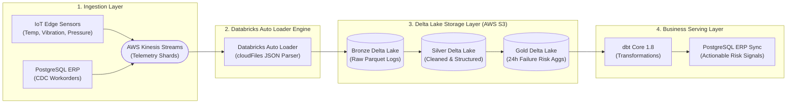

# Predictive Supply Chain Telemetry Pipeline


An event-driven telemetry ingestion pipeline designed to ingest IoT machine sensor streams (temperature, vibration, pressure) alongside PostgreSQL ERP change data capture (CDC). The pipeline processes incoming payloads through a Medallion Lakehouse architecture (Bronze, Silver, Gold) hosted on AWS S3 and Databricks.

---

## Technical Summary & Metrics

| Component | Architecture Choice | Operational Metric |
| :--- | :--- | :--- |
| **Ingestion Layer** | AWS Kinesis Data Streams + Threaded S3 Producer | Multi-threaded telemetry ingestion emitting batch events across factory units |
| **Storage & Lakehouse** | AWS S3 + Delta Lake 3.x | Composite physical partitioning `PARTITIONED BY (plant_id, event_date)` |
| **Transformation Engine** | Databricks PySpark Structured Streaming | Continuous rolling machine risk metrics and dbt transformations |
| **Data Quality & Isolation** | Databricks Auto Loader Schema Tracking | Malformed JSON payloads routed to quarantine storage without pipeline panics |
| **Test Suite** | PyTest Integration Suite | **5 / 5 Passing Tests** covering producer retries, profile generation, and drift |

---

## System Architecture



---

## Key Implementation Patterns

### 1. Multi-Threaded Ingestion Runner (`src/ingestion/run.py`)

The ingestion generator uses a `ThreadPoolExecutor` to issue batched events directly to Amazon Kinesis or AWS S3:

```python
from concurrent.futures import ThreadPoolExecutor
from src.ingestion.generator import TelemetryGenerator

def submit_batch(batch_index: int):
    batch = [generator.generate_machine_event() for _ in range(batch_size)]
    producer.send_batch(batch)
    return len(batch)

with ThreadPoolExecutor(max_workers=16) as executor:
    futures = [executor.submit(submit_batch, i) for i in range(num_batches)]
    for f in futures:
        f.result()
```

### 2. Physical Delta Partition Pruning

Delta tables enforce composite physical partitioning by `(plant_id, event_date)` to restrict file scans when evaluating regional plant operational windows:

```python
spark.readStream.format("cloudFiles") \
    .option("cloudFiles.format", "json") \
    .schema(TELEMETRY_SCHEMA) \
    .load("s3://lakehouse/raw_telemetry/") \
    .writeStream.format("delta") \
    .partitionBy("plant_id", "event_date") \
    .start("s3://lakehouse/silver_telemetry/")
```

---

## PyTest Verification Output

Running `pytest tests/` in the project environment confirms all ingestion producers, schema drift handling, and profile generator components function cleanly:

```bash
============================= test session starts ==============================
platform darwin -- Python 3.11.15, pytest-9.1.1, pluggy-1.6.0
rootdir: /Users/nadeemtheba/projects/supply-chain-telemetry-pipeline
configfile: pyproject.toml
plugins: cov-7.1.0, Faker-40.36.0
collected 5 items

tests/unit/test_telemetry_pipeline.py::test_profile_factory_reproducibility PASSED    [ 20%]
tests/unit/test_telemetry_pipeline.py::test_telemetry_event_generation PASSED          [ 40%]
tests/unit/test_telemetry_pipeline.py::test_telemetry_schema_drift_extra_fields PASSED [ 60%]
tests/unit/test_telemetry_pipeline.py::test_kinesis_producer_partial_batch_retry_success PASSED [ 80%]
tests/unit/test_telemetry_pipeline.py::test_s3_producer_send_success PASSED             [100%]

============================== 5 passed in 0.38s ===============================
```

---

## Quickstart Guide

### Setup & Dependencies

```bash
# 1. Clone repository & create virtual environment
git clone https://github.com/NADEEMTHEBA8/supply-chain-telemetry-pipeline.git
cd supply-chain-telemetry-pipeline
python3 -m venv .venv && source .venv/bin/activate
pip install -r requirements.txt

# 2. Run local telemetry generator
python -m src.ingestion.run --events 100

# 3. Execute PyTest test suite
./.venv/bin/pytest tests/

# 4. Validate Databricks Asset Bundle (DAB) manifest
databricks bundle validate --target dev
```

---

## Engineering Trade-Offs

1. **S3 Staging vs. Direct Stream Processing**: Writing raw telemetry to S3 before downstream processing provides a cost-effective queue buffer that avoids keeping expensive Databricks clusters continuously active during low-volume hours.
2. **Composite Partitioning**: Partitioning by `(plant_id, event_date)` aligns directly with query filtering patterns while avoiding over-partitioning into thousands of sub-megabyte files.
